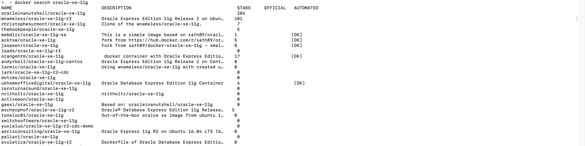
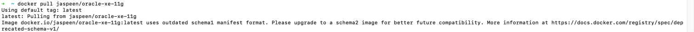

# mac os (apple silicon) oracledb설치

- Oracle은 MacOs를 정식 지원하지 않는다고 한다.
- MacOs에 Oracle DB 설치하는 방법은 두 가지가 있음
  - Oracle Cloud에 DB를 띄워 사용하는 방법
  - 오픈소스 컨테이너 런타임 Colima를 사용해 oci-oracle-xe 이미지를 x86/64 가상 환경으로 띄워 사용하는 방법

#### Docker / Colima를 이용하는 방법
> window와 크게 다르지는 않지만 추가해주어야 하는 옵션들이 있어 따로 기록  

#### 설치
- oracle-xe-11g설치 과정
- docker 내에서 이미지 검색
```text
docker search oracle-xe-11g
```

- 이미지 다운로드
```text
docker pull jaspeen/oracle-xe-11g
```

- docker 컨테이너 실행하기
- docker run 명령어를 통해 docker 컨테이너를 실행하고 오라클 서버 띄우기
```text
docker run -dit --name oracle11 --platform linux/amd64 -e ORACLE_PASSWORD=password -p 1521:1521 jaspeen/oracle-xe-11g
```
> - -dit
>   - Docker 컨테이너가 백그라운드에서 실행되면서 사용자와 상호작용이 가능한 상태로 설정
>   - -d -i -t 합친 옵션
> - --name 옵션
>   - 컨테이너를 지칭하는 이름을 부여하는 옵션, 자유롭게 지정 가능
>   - 컨테이너 ID 대신에 사용
> - -e 옵션
>   - 컨테이너의 환경 변수 설정
>   - ORACLE_PASSWORD 라는 환경변수에 앞으로 사용할 비밀번호를 할당
> - -p 옵션
>   - 포트 배포 및 바인딩을 위한 옵션
>   - 오라클 기본 접속 포트는 1521로 사용되어 동일하게 설정
> - --platform 옵션
>   - 특정 플랫폼 지정
>   - `docker run` 명령어나 `docker pull` 명령어를 사용할 때 특정 플랫폼을 요청할 수 있음
>   - 지정 안 했더니 에러 발생..
>   - 
>   - gpt가 알려준 해결방법
>     1. 특정 프랫폼 지정
>     2. 다중 플랫폼 이미지 사용 : 가능하다면, 여러 플랫폼을 지원하는 다중 플랫폼 이미지를 사용하는 것이 좋다. 호스트 플랫폼에 상관없이 이미지가 작동
>     3. 호스트 플랫폼 변경 : 호스트의 플랫폼을 변경하여 이미지를 호환되게 만들 수 있음. 이 방법은 하드웨어나 운영 체제를 변경하는 것이 필요
>     4. 시스템 업데이트 : 호스트 시스템을 최신 상태로 유지하고, Docker 엔진과 관련 도구를 최신 버전으로 업데이트 하는 것이 좋음
- `docker logs -f 컨테이너명` DB로그 확인 후 "Database ready to use. Enjoy! ;)"가 뜨면 성공

#### SQL plus 실행
- 생성한 컨테이너가 실행중에 있다면 명령어를 통해 SQL plus를 실행 시킬 수 있음
```text
docker exec -it oracle11 sqlplus
```
- 유저이름과 패스워드 입력을 해야하는데 user-name은 system, password는 컨테이너 실행 시 설정한 비밀번호를 입력하면 된다.
- sqlplus실행 후 새로운 사용자 만들고 DB툴에서 접속 하면 끝
- mac에서는 윈도우와 달리 host를 localhost로 지정해주면 접속이 된다.

#### 참고링크
- [https://velog.io/@devsaza/M1-M2-Mac-OS%EC%97%90%EC%84%9C-Oracle-DB-%EC%82%AC%EC%9A%A9%ED%95%98%EA%B8%B0](https://velog.io/@devsaza/M1-M2-Mac-OS%EC%97%90%EC%84%9C-Oracle-DB-%EC%82%AC%EC%9A%A9%ED%95%98%EA%B8%B0)
- [https://velog.io/@xangj0ng/M1-Oracle-DB-%EC%84%A4%EC%B9%98](https://velog.io/@xangj0ng/M1-Oracle-DB-%EC%84%A4%EC%B9%98)
- [https://bortfolio.tistory.com/136](https://bortfolio.tistory.com/136)
- [https://bio-info.tistory.com/136](https://bio-info.tistory.com/136)


