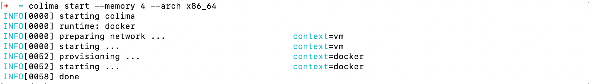

# 맥 도커 설치

### 도커
#### 설치
- homebrew에서 설치하려고 하였으나 intell용으로 다운로드 받아지는 건지 계속 에러가 나서 홈페이지에서 apple silicon 용으로 다운로드 받음
- [https://docs.docker.com/desktop/install/mac-install/](https://docs.docker.com/desktop/install/mac-install/)
- 설치를 하면 docker desktop을 사용하게 되는데 검색해보니 colima라는 오픈소스가 많이 사용되는 것 같아 함께 설치 

### Colima
> Colima는 무거운 Docker Desktop을 대신해 간단한 CLI 환경에서 도커 컨테이너들을 실행할 수 있는 오픈 소스 소프트웨어
#### 설치
- 인텔 맥
```text
brew install colima
```
- 애플 실리콘 맥
```text
arch -arm64 brew install
```
- Colima와 Docker 모두 설치 후 colima를 x86_64환경으로 실행
```text
colima start --memory 4 --arch x86_64
```
- done이라는 문장이 나오면 완료된 것

- `docker ps` 실행이 되면 설치 완료


