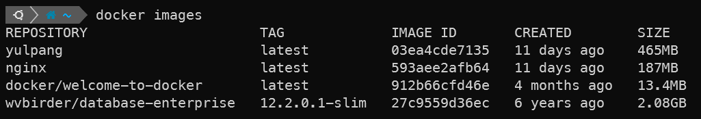
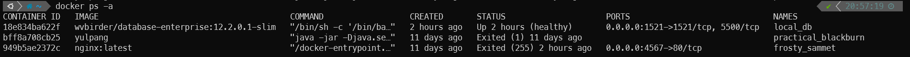
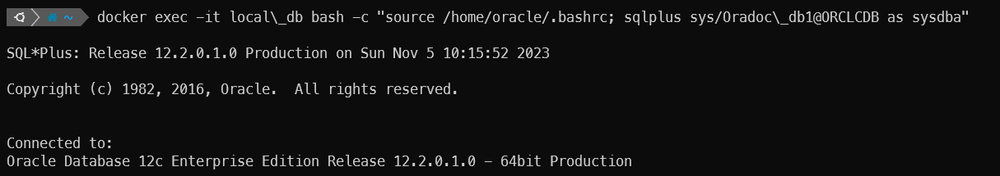
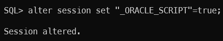

# docker oracle db 설치 - window wsl2

### 1. Docker Login
- Oracle 이미지를 다운로드 받기 위해서는 Docker hub에 로그인이 되어 있어야 한다.
  - [hub.docker.com](https://hub.docker.com/)

### 2. Oracle 이미지 다운로드
- Docker pull 명령으로 이미지를 다운로드 받는다. (12c 버전으로 진행)
```text
~# docker pull wvbirder/database-enterprise:12.2.0.1-slim
```
- docker image확인  


### 3. 이미지를 컨테이너로 띄운다.
- --name 옵션을 부여하면 다음 실행(start)때 이름을 이용해 실행 할 수 있다.
```text
~# docker run -dit --name local_db -p 1521:1521 wvbirder/database-enterprise:12.2.0.1-slim
```

### 4. 컨테이너 구동 확인
```text
~# docker ps -a
```

- STATUS가 Up이면 컨테이너가 구동중인 것

### 5. Docker 실행 로그를 확인하면서 완료될 때 까지 기다린다.
```text
~# docker logs -f local_db
```

### 6. Oracle 접속 계정 생성
```text
~# docker exec -it local_db bash -c "source /home/oracle/.bashrc; sqlplus sys/Oradoc_db1@ORCLCDB as sysdba"
```

- docker exec
  - 도커 외부에서 컨테이너로 명령어를 전달하여 컨테이너에서 실행되도록 한다.
  - 컨테이너의 쉘을 직접 열지 않고 명령어를 전달 할 수 있다.

### 7.Oracle 12c에서 사용자 생성 시 기존과 같은 방법로 추가하기 위한 설정
```text
SQL> alter session set "_ORACLE_SCRIPT"=true;
```


### 8. 사용자 생성 및 권한 할당
```text
SQL> create user test identified by password;

User created.

SQL> grant connect, resource, dba to test;

Grant succeeded.

SQL> commit;

Commit complete.
```
- 이 단계까지 진행하면 기본 설치 및 설정은 완료한 것

### 9. 한국 시간대와 한글 설정을 위한 문자 코드셋 설정
```text
  SQL> update sys.props$ set value$='KOREAN_KOREA.UTF8' where name='NLS_LANGUAGE';
  
  1 row updated.
  
  SQL> update sys.props$ set value$='UTF8' where name='NLS_CHARACTERSET';
  
  1 row updated.
  
  SQL> update sys.props$ set value$='UTF8' where name='NLS_NCHAR_CHARACTERSET';
  
  1 row updated.
  
  SQL> update sys.props$ set value$='KO16MSWIN949' where name='NLS_CHARACTERSET';
  
  1 row updated.
  
  SQL> update sys.props$ set value$='KO16MSWIN949' where name='NLS_NCHAR_CHARACTERSET';
  
  1 row updated.
  
  SQL> update sys.props$ set value$='AMERICAN_AMERICA.KO16MSWIN949' where name='NLS_LANGUAGE';
  
  1 row updated.
  
  SQL> commit;
  
  Commit complete.
```

### 10. 코드셋 설정 후 데이터 베이스 재기동
```text
  SQL> shutdown immediate;
  Database closed.
  Database dismounted.
  ORACLE instance shut down.
  ERROR:
  ORA-12514: TNS:listener does not currently know of service requested in connect
  descriptor
  
  Warning: You are no longer connected to ORACLE.
  
  SQL> startup;
  SP2-0640: Not connected
  
  SQL> conn \as sysdba
  SP2-0306: Invalid option.
  Usage: CONN[ECT] [{logon|/|proxy} [AS {SYSDBA|SYSOPER|SYSASM|SYSBACKUP|SYSDG|SYSKM|SYSRAC}] [edition=value]]
  where <logon> ::= <username>[/<password>][@<connect_identifier>]
        <proxy> ::= <proxyuser>[<username>][/<password>][@<connect_identifier>]
        
  SQL> conn /as sysdba
  Connected to an idle instance.
  
  SQL> startup;
  ORACLE instance started.
  
  Total System Global Area 1342177280 bytes
  Fixed Size                  8792536 bytes
  Variable Size             587204136 bytes
  Database Buffers          738197504 bytes
  Redo Buffers                7983104 bytes
  Database mounted.
  Database opened.
```

### 11. DB툴을 활용해 접속 확인
```text
기본적으로 설치되는 Oracle 정보는 다음과 같다.
USER = sys / Oradoc_db1
DB_SID=ORCLCDB
DB_PDB=ORCLPDB1
DB_MEMORY=2GB
DB_DOMAIN=localdomain
```
- window의 경우 wsl를 사용해 도커환경을 띄우므로 wsl host os의 ip를 확인 후 접속
- 고정된 ip가 아니니 ip 고정시키는 방법을 찾거나 wsl실행 때 마다 ip 확인 후 접속하자

### wsl ip확인 방법
```text
$ cat /etc/resolv.conf
# This file was automatically generated by WSL. To stop automatic generation of this file, add the following entry to /etc/wsl.conf:
# [network]
# generateResolvConf = false
nameserver 000.00.0.1 <- ip주소
```


> - **[참고링크]**
>   - https://gomguk.tistory.com/69
>   - https://kindloveit.tistory.com/13
>   - https://yooloo.tistory.com/27
>   - https://imitursa.tistory.com/4370